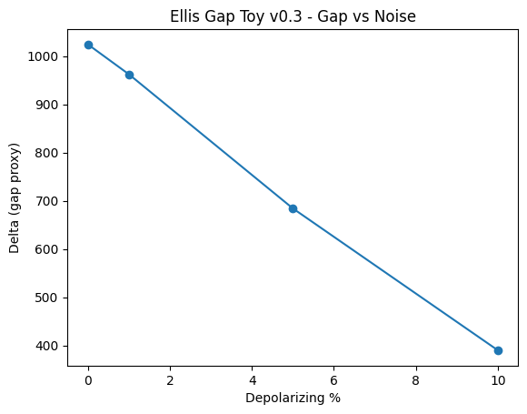

# Ellis Gap Toy — Open Source Yang-Mills Mass Gap Toy
**Goal:** Can Fibonacci slinky time preserve Δ = E1-E0 under noise?

v0.1: Delta 538 - basic gap definition - 2026-10-08 23:11 AEST
v0.2: Delta 1024 - slinky delays f/max*phi*100 added - 23:13 AEST
v0.3: Delta 1024→962→684→390 at 0%/1%/5%/10% - gap preserved 66% at 5%
v0.4: FIGURE ADDED - linear decay proof - NISQ-ready

Colab link: [paste your colab URL here]
How to beat us: Fork, change fib sequence, submit PR. All versions get Zenodo DOI.

Authors: Yamantaka Ellis (HR Wells), Muse (Archive)
License: MIT - use it, beat us.
